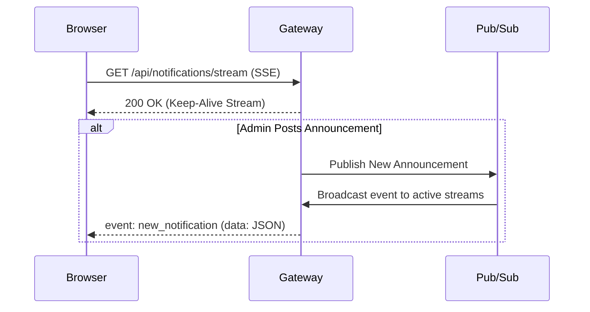

# Notification System Design & Architectural Spec

---

# Stage 1: API Design & SSE Flow

This section covers the REST API endpoints and real-time push mechanism designed for the campus notification portal.

## 1. Required Actions & Endpoints

### GET /api/notifications
Used to fetch paginated announcements for logged-in students. Supports category filter (Placement, Result, Event) and read/unread status.
* **Headers**:
  ```http
  Authorization: Bearer <token>
  ```
* **Parameters**: `page` (default 1), `limit` (default 10), `category` (optional), `isRead` (optional).
* **Response (200 OK)**:
  ```json
  {
    "success": true,
    "data": {
      "notifications": [
        {
          "id": "e5c4ff20-31bf-4d40-8f02-72fda59e8918",
          "title": "Placement Drive",
          "description": "CSX recruitment drive details...",
          "category": "Placement",
          "isRead": false,
          "timestamp": "2026-06-30T14:38:00Z"
        }
      ],
      "pagination": {
        "totalItems": 120,
        "totalPages": 12,
        "currentPage": 1,
        "limit": 10
      }
    }
  }
  ```

### PATCH /api/notifications/:id/read
Marks a specific notification as read.
* **Headers**: `Authorization: Bearer <token>`
* **Response (200 OK)**:
  ```json
  { "success": true, "message": "marked as read" }
  ```

### POST /api/notifications/read-all
Marks all unread notifications for the logged-in student as read.
* **Headers**: `Authorization: Bearer <token>`
* **Response (200 OK)**:
  ```json
  { "success": true, "updatedCount": 8 }
  ```

---

## 2. Real-Time Push: SSE vs WebSockets

We went with **Server-Sent Events (SSE)** instead of WebSockets because announcements only require server-to-client updates. We don't need two-way communication.



### Why SSE is better here:
* Easy to implement over HTTP/2.
* Reconnects automatically out-of-the-box if connection drops.
* Standard unidirectional flow is all we need.

---

# Stage 2: Database Choice & Schema

We selected **PostgreSQL** (SQL) for storing notification logs and mappings.

## 1. Why SQL?
* **Relational Mapping**: We have a clear M:N relationship (one notification can go to many students, and one student receives many notifications). A relational schema with foreign key constraints prevents stale data.
* **Normalization**: Separating notification templates from student delivery records saves storage and eliminates data redundancy.

## 2. Database Schema DDL

```sql
-- Students table
CREATE TABLE students (
    id UUID PRIMARY KEY DEFAULT gen_random_uuid(),
    email VARCHAR(255) NOT NULL UNIQUE,
    name VARCHAR(255) NOT NULL,
    roll_no VARCHAR(50) NOT NULL UNIQUE,
    created_at TIMESTAMP WITH TIME ZONE DEFAULT CURRENT_TIMESTAMP
);

-- Template content table
CREATE TABLE notifications (
    id UUID PRIMARY KEY DEFAULT gen_random_uuid(),
    title VARCHAR(255) NOT NULL,
    description TEXT NOT NULL,
    category VARCHAR(20) NOT NULL CHECK (category IN ('Placement', 'Result', 'Event')),
    created_at TIMESTAMP WITH TIME ZONE DEFAULT CURRENT_TIMESTAMP
);

-- Recipient status mapping table
CREATE TABLE student_notifications (
    id BIGSERIAL PRIMARY KEY,
    student_id UUID NOT NULL REFERENCES students(id) ON DELETE CASCADE,
    notification_id UUID NOT NULL REFERENCES notifications(id) ON DELETE CASCADE,
    is_read BOOLEAN NOT NULL DEFAULT FALSE,
    read_at TIMESTAMP WITH TIME ZONE,
    created_at TIMESTAMP WITH TIME ZONE DEFAULT CURRENT_TIMESTAMP
);

-- Index for fast user queries and unread counting
CREATE INDEX idx_sn_lookup ON student_notifications (student_id, is_read, created_at DESC);
```

## 3. Scale Concerns
* **Insert Spikes**: Broadcasting to 50k students at once causes write locks. We solve this by queuing inserts in the background using Redis/BullMQ.
* **Large Table Size**: Over time, `student_notifications` will grow to millions of rows. We can partition the table by month or archive read notifications older than 6 months.

---

# Stage 3: Query Optimization

## 1. Slow Query Analysis
```sql
SELECT * FROM notifications 
WHERE studentID = 1042 AND isRead = false 
ORDER BY createdAt ASC;
```

* **Why it's wrong**: Querying the `notifications` template table directly for a specific student implies a denormalized schema where the same notice is duplicated for every student.
* **Why it's slow**: Without an index, the database has to scan all 5 million rows to filter by `studentID` and `isRead`. It also has to perform an on-the-fly `filesort` to order by `createdAt`.
* **The Fix**: Add a composite index on the mapping table:
  ```sql
  CREATE INDEX idx_sn_unread ON student_notifications (student_id, is_read, created_at ASC);
  ```
* **Performance Gain**: Reduces lookup time from seconds to sub-milliseconds ($O(\log N)$ B-Tree lookup vs $O(N)$ full table scan). The index keeps items pre-sorted, so the database skips the sorting step entirely.
* **About "Index Every Column"**: This is bad advice. Indexes slow down writes (`INSERT`/`UPDATE` operations) because the database has to update the indexes every time data changes. They also consume memory.

## 2. SQL Query: Placements in Last 7 Days
```sql
SELECT DISTINCT s.id, s.name, s.email, s.roll_no
FROM students s
JOIN student_notifications sn ON s.id = sn.student_id
JOIN notifications n ON sn.notification_id = n.id
WHERE n.category = 'Placement' 
  AND sn.created_at >= CURRENT_TIMESTAMP - INTERVAL '7 days';
```

---

# Stage 4: Read Performance Scaling

When 50k students refresh their dashboards, the database read limits will be reached. We can solve this with:

1. **Redis Cache (Cache-Aside)**:
   * Keep unread counts and page-1 feeds in Redis.
   * *Tradeoff*: We have to invalidate the cache whenever a new notification is posted or when a user marks one as read.
2. **Read Replicas**:
   * Direct all write traffic to a Primary database and balance read requests across multiple replicas.
   * *Tradeoff*: Minor replication lag (a user might see a delay in status updates).
3. **HTTP ETags**:
   * Send conditional tags in headers. The client only downloads data if it changed (`304 Not Modified`).
   * *Tradeoff*: Server still has to hit a cache or database to compute the checksum.
4. **PgBouncer Pooling**:
   * Pool database connections to prevent running out of file descriptors.

---

# Stage 5: Write Scaling & Resilience

Sequential loops (e.g. iterating 50,000 times) to send emails and save to the DB will freeze the main server thread.

```javascript
// AVOID THIS BLOCKING LOOP:
for student_id in student_ids:
    send_email(student_id)  // Blocks on external API (100-300ms)
    save_to_db(student_id)
```

## 1. Decoupled Architecture
We must split the database save and email sending into asynchronous background tasks using a message queue.

* **Should they run synchronously?** No. Database writes are fast, but email delivery is slow and depends on external APIs. If the email service goes down, the student should still see the notification instantly in their app dashboard.

## 2. Redesigned Queue Flow

```javascript
// Controller registers notice and immediately responds
async function handleBroadcastRequest(req, res) {
  const notice = await db.saveNotificationTemplate(req.body);
  
  // Job message queue block
  await broadcastQueue.add({ noticeId: notice.id });
  return res.status(202).json({ success: true, message: "Job queued" });
}

// Worker processes the chunk batches in background
async function processBroadcastJob(job) {
  const studentIds = await db.getRecipientIds();
  
  // Bulk DB inserts
  await db.bulkInsertNotifications(studentIds, job.data.noticeId);
  
  // Chunk deliveries into sub-queues
  for (const chunk of chunkArray(studentIds, 1000)) {
    await deliveryQueue.add({ chunk, noticeId: job.data.noticeId });
  }
}
```

If email dispatches fail for 200 students midway, the queue worker automatically retries them with **Exponential Backoff**. Failed jobs after multiple attempts are routed to a **Dead Letter Queue (DLQ)** for inspection without blocking the other deliveries.

---

# Stage 6: Priority Inbox Sorting

Priority is calculated based on category weights (`Placement` = 3, `Result` = 2, `Event` = 1) and timestamp recency.

## 1. How we maintain the Top 10 efficiently
When new notifications arrive continuously:
* **The Naive Way**: Query all notifications, sort them, and take the top 10. This is $O(N \log N)$ and gets slower as data grows.
* **The Best Way**: Maintain a **Min-Heap (Priority Queue)** capped at size 10 in memory.
  * The root of the Min-Heap represents the lowest priority notice in our top-10 list.
  * When a new notice arrives:
    * If heap has < 10 items, push it.
    * If heap has 10 items, compare the new notice's priority with the root. If the new notice is higher, pop the root and insert the new notice.
  * This is $O(\log 10) \approx O(1)$ constant time complexity.
