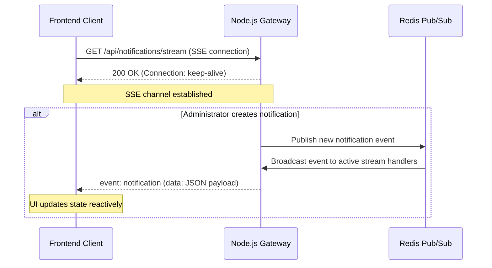
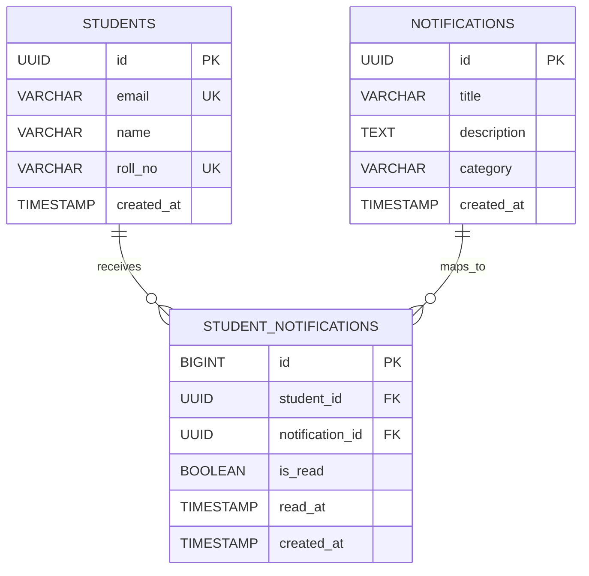

# Campus Notification System Design

---

# Stage 1: API Contract & Design

This stage outlines the REST API design, headers, payload structures, JSON schemas, and real-time push mechanisms for the campus notification platform.

---

## 1. Core Platform Actions
To display notifications to users when they are logged in, the platform must support:
1. **Retrieve Paginated Notifications**: Fetch notifications dynamically with support for filtering by type (`Placement`, `Result`, `Event`) and read/unread status.
2. **Mark Notification as Read**: Allow a student to mark a specific notification as read.
3. **Mark All Notifications as Read**: Provide a one-click action to mark all notifications as read.
4. **Push Real-Time Notifications**: Stream notifications instantly to connected clients without page reloads.
5. **Create Notification**: Allow administration (e.g. HR, Coordinators) to publish new notifications.

---

## 2. API Endpoints Contract

### A. Fetch Notifications
* **HTTP Method**: `GET`
* **Path**: `/api/notifications`
* **Headers**:
  ```http
  Authorization: Bearer <JWT_TOKEN>
  Accept: application/json
  ```
* **Query Parameters**:
  * `page` (integer, default: `1`): The page index.
  * `limit` (integer, default: `10`): Number of notifications per page.
  * `category` (string, optional): Category filter. Allowed values: `Placement`, `Result`, `Event`.
  * `isRead` (boolean, optional): Read status filter (`true` or `false`).
* **Response (Status Code: 200 OK)**:
  ```json
  {
    "success": true,
    "data": {
      "notifications": [
        {
          "id": "e5c4ff20-31bf-4d40-8f02-72fda59e8918",
          "title": "CSX Corporation Hiring",
          "description": "CSX Corporation is visiting for a software engineering placement drive.",
          "category": "Placement",
          "isRead": false,
          "timestamp": "2026-06-30T14:38:00.000Z"
        }
      ],
      "pagination": {
        "totalItems": 150,
        "totalPages": 15,
        "currentPage": 1,
        "limit": 10,
        "hasNextPage": true,
        "hasPrevPage": false
      },
      "unreadCount": 12
    }
  }
  ```

---

### B. Mark a Single Notification as Read
* **HTTP Method**: `PATCH`
* **Path**: `/api/notifications/:id/read`
* **Headers**:
  ```http
  Authorization: Bearer <JWT_TOKEN>
  Content-Type: application/json
  ```
* **Response (Status Code: 200 OK)**:
  ```json
  {
    "success": true,
    "message": "Notification marked as read",
    "data": {
      "id": "e5c4ff20-31bf-4d40-8f02-72fda59e8918",
      "isRead": true
    }
  }
  ```

---

### C. Mark All Notifications as Read
* **HTTP Method**: `POST`
* **Path**: `/api/notifications/read-all`
* **Headers**:
  ```http
  Authorization: Bearer <JWT_TOKEN>
  ```
* **Response (Status Code: 200 OK)**:
  ```json
  {
    "success": true,
    "message": "All notifications marked as read",
    "updatedCount": 12
  }
  ```

---

### D. Create Notification (Admin / Coordinators)
* **HTTP Method**: `POST`
* **Path**: `/api/notifications`
* **Headers**:
  ```http
  Authorization: Bearer <JWT_TOKEN>
  Content-Type: application/json
  ```
* **Request Body Schema**:
  ```json
  {
    "title": "Mid-Sem Exams Schedule Out",
    "description": "The timetable for the mid-semester evaluation is published.",
    "category": "Result",
    "targetStudents": "ALL"
  }
  ```
* **Response (Status Code: 201 Created)**:
  ```json
  {
    "success": true,
    "data": {
      "id": "8a7412bd-6065-4d09-8501-a37f11cc848b",
      "title": "Mid-Sem Exams Schedule Out",
      "description": "The timetable for the mid-semester evaluation is published.",
      "category": "Result",
      "isRead": false,
      "timestamp": "2026-06-30T14:40:00.000Z"
    }
  }
  ```

---

## 3. Real-Time Notification Delivery Mechanism

To deliver real-time notifications, we recommend using **Server-Sent Events (SSE)** rather than WebSockets.



### Why Server-Sent Events (SSE)?
1. **Unidirectional Simplicity**: Notifications are pushed from server to client. SSE is unidirectional by design, unlike WebSockets which are bidirectional.
2. **Native Reconnection**: Browsers automatically attempt reconnection when SSE streams drop, emitting lifecycle handlers out-of-the-box.
3. **HTTP/2 friendly**: Easily multiplexes over HTTP/2, bypassing client socket limits.
4. **Header Integration**: Native support for passing authorization credentials during connection establishment (via token query parameters or standard headers depending on the Client wrapper).

---

# Stage 2: Persistent Storage & Schema Design

This stage recommends a storage choice, defines the database schemas and indexes, addresses potential data scaling concerns, and documents corresponding queries.

---

## 1. Database Selection & Justification

We recommend a **Relational Database (RDBMS)**, specifically **PostgreSQL**, to persistently store notifications and their delivery states.

### Justification:
1. **Relational Integrity**: Campus structures (Students, Batches, Courses, Placements, Events) are highly relational. Enforcing foreign key constraints prevents orphan mappings (e.g. mapping a notification to a non-existent student).
2. **Normalized Data Mappings**: A notification is typically sent to thousands of students. Separating the *content* (`notifications`) from the *delivery status* (`student_notifications`) avoids massive text redundancy and saves storage.
3. **Transaction Compliance (ACID)**: Critical notifications (like Placement application deadlines) require absolute consistency.
4. **Index Optimizations**: Multi-column indexes (B-Trees) can optimize filtering on student IDs, read flags, and timestamps.

---

## 2. Database Schema (DDL)



### SQL Table Definitions:

```sql
-- 1. Students Table
CREATE TABLE students (
    id UUID PRIMARY KEY DEFAULT gen_random_uuid(),
    email VARCHAR(255) NOT NULL UNIQUE,
    name VARCHAR(255) NOT NULL,
    roll_no VARCHAR(50) NOT NULL UNIQUE,
    created_at TIMESTAMP WITH TIME ZONE DEFAULT CURRENT_TIMESTAMP
);

-- 2. Notifications Template Table (Stores core metadata once)
CREATE TABLE notifications (
    id UUID PRIMARY KEY DEFAULT gen_random_uuid(),
    title VARCHAR(255) NOT NULL,
    description TEXT NOT NULL,
    category VARCHAR(20) NOT NULL CHECK (category IN ('Placement', 'Result', 'Event')),
    created_at TIMESTAMP WITH TIME ZONE DEFAULT CURRENT_TIMESTAMP
);

-- 3. Student Notifications Mapping Table (Tracks delivery state & read flags per student)
CREATE TABLE student_notifications (
    id BIGSERIAL PRIMARY KEY,
    student_id UUID NOT NULL REFERENCES students(id) ON DELETE CASCADE,
    notification_id UUID NOT NULL REFERENCES notifications(id) ON DELETE CASCADE,
    is_read BOOLEAN NOT NULL DEFAULT FALSE,
    read_at TIMESTAMP WITH TIME ZONE,
    created_at TIMESTAMP WITH TIME ZONE DEFAULT CURRENT_TIMESTAMP
);
```

### Index Optimization Definitions:
```sql
-- Index to optimize fetching user-specific notifications and unread counts
CREATE INDEX idx_student_notifications_lookup 
ON student_notifications (student_id, is_read, created_at DESC);

-- Index to optimize looking up notifications by category
CREATE INDEX idx_notifications_category 
ON notifications (category);
```

---

## 3. Scalability Concerns & Mitigation Strategies

As the dataset grows (e.g. 5,000,000 notifications for 50,000 students):

1. **Write Amplification (Broadcast Storm)**: Creating a notification for `"ALL"` students inserts 50,000 rows into `student_notifications` at once, locking tables and consuming connections.
   * *Mitigation*: 
     * Perform writes asynchronously via **queuing** (RabbitMQ or BullMQ).
     * Utilize bulk insert batching rather than individual SQL `INSERT` statements.
2. **Index Bloat**: The index `idx_student_notifications_lookup` will grow extremely large, slowing down page loads.
   * *Mitigation*: 
     * Implement **Database Partitioning** (e.g., range partitioning `student_notifications` by `created_at` monthly, or list partitioning by `is_read`).
     * Introduce a caching layer (**Redis**) to store active unread notification counts per student ID, avoiding database hits altogether on common page renders.
     * Establish a data archiving policy: Move older notifications (e.g. > 6 months) to historical logs or cold storage.

---

## 4. API-to-Query Mapping (Raw SQL)

### A. Fetch Paginated Notifications (with Category and Read Filters)
```sql
SELECT 
    n.id, 
    n.title, 
    n.description, 
    n.category, 
    sn.is_read, 
    sn.created_at
FROM student_notifications sn
JOIN notifications n ON sn.notification_id = n.id
WHERE sn.student_id = :student_id
  -- Optional category filter:
  AND (:category_filter IS NULL OR n.category = :category_filter)
  -- Optional read status filter:
  AND (:is_read_filter IS NULL OR sn.is_read = :is_read_filter)
ORDER BY sn.created_at DESC
LIMIT :limit OFFSET :offset;
```

### B. Mark a Single Notification as Read
```sql
UPDATE student_notifications
SET 
    is_read = TRUE, 
    read_at = CURRENT_TIMESTAMP
WHERE student_id = :student_id 
  AND notification_id = :notification_id;
```

### C. Mark All Notifications as Read
```sql
UPDATE student_notifications
SET 
    is_read = TRUE, 
    read_at = CURRENT_TIMESTAMP
WHERE student_id = :student_id 
  AND is_read = FALSE;
```

### D. Create & Broadcast Notification
1. Insert content template:
   ```sql
   INSERT INTO notifications (title, description, category)
   VALUES (:title, :description, :category)
   RETURNING id;
   ```
2. Bulk insert relationships for all target students:
   ```sql
   INSERT INTO student_notifications (student_id, notification_id)
   SELECT id, :new_notification_id 
   FROM students;
   ```

---

# Stage 3: Database Query Optimization

This stage analyzes and optimizes queries for high-volume notification stores containing 50,000 students and 5,000,000 notifications.

---

## 1. Analysis of the Original Query

```sql
SELECT * FROM notifications 
WHERE studentID = 1042 AND isRead = false 
ORDER BY createdAt ASC;
```

### Q1: Is this query accurate?
* **Accuracy Verdict**: **No, it violates database design standards.**
* **Explanation**:
  - The query targets the `notifications` table directly for a specific `studentID` and `isRead` flag.
  - In a relational system, this implies a single denormalized table where the notification content is duplicated for every recipient. For instance, broadcasting a notification to all 50,000 students duplicates the `title`, `description`, and `category` 50,000 times.
  - In a properly normalized schema (as defined in Stage 2), the `notifications` table stores content templates, while `student_notifications` maps recipient relationships. Thus, the query is architecturally sub-optimal and should perform a relational `JOIN`.

---

### Q2: Why is this query slow?
* **Explanation**:
  1. **Full Table Scan**: Without a composite index, the database engine must inspect all 5,000,000 rows to filter for `studentID = 1042` and `isRead = false`.
  2. **Sub-optimal Single-Column Indexes**: If individual indexes exist on `studentID` or `isRead`:
     - Indexing `isRead` is useless due to low cardinality (only two possible values: `true` or `false`).
     - Indexing `studentID` helps filter, but the database still has to load all notifications for student 1042 into memory, filter out read ones, and then perform a sort.
  3. **Filesort Sorting Overhead**: The query contains `ORDER BY createdAt ASC`. Sorting thousands of matching rows on the fly without a matching pre-sorted index requires a `filesort` operation (External Merge Sort), which consumes significant CPU and disk I/O.

---

### Q3: Recommended Optimization & Computation Cost
* **Optimization Strategy**: Introduce a composite index on the mapping table that covers the filters and the sort order:
  ```sql
  CREATE INDEX idx_student_notifications_unread_opt 
  ON student_notifications (student_id, is_read, created_at ASC);
  ```
* **Why this works**:
  * The database traverses the B-Tree index using the high-cardinality `student_id` first.
  * It filters matches using the low-cardinality `is_read = false` next.
  * The remaining matching nodes are already leaf-sorted by `created_at ASC` within the index structure, completely bypassing the expensive `filesort` phase.
* **Computation Cost comparison**:
  * **Before Indexing**: $O(N)$ lookup (Full Table Scan) + $O(K \log K)$ sorting cost (where $N$ is 5,000,000 and $K$ is the student's notification volume). Response time: **seconds**.
  * **After Indexing**: $O(\log N + M)$ lookup and retrieval (where $M$ is the number of unread notifications for the student, typically < 20). Response time: **< 1 millisecond**.

---

### Q4: Critiquing "Index Every Column" Advice
* **Verdict**: **This advice is highly ineffective and dangerous.**
* **Reasons**:
  1. **Write Overhead**: Every time a row is inserted, updated, or deleted, *every single index* on that table must be updated. This severely degrades write/insert performance.
  2. **Storage Inflation**: Indexes consume RAM and disk. Indexing every column can cause the indexes to exceed database buffer pool size, forcing disk swaps.
  3. **Compound Query Inefficiency**: Queries filtering on multiple columns (e.g. `student_id = ? AND is_read = ?`) cannot merge multiple single-column indexes efficiently. They require composite (multi-column) indexes.
  4. **Planner Inefficiency**: Too many indexes confuse the optimizer's statistics selection, sometimes leading to poor query plans.

---

## 2. Target Query: Placement Notifications in Last 7 Days

To fetch all students who received a placement notification in the last 7 days under our optimized normalized database structure:

```sql
SELECT DISTINCT 
    s.id AS student_id,
    s.name,
    s.email,
    s.roll_no
FROM students s
JOIN student_notifications sn ON s.id = sn.student_id
JOIN notifications n ON sn.notification_id = n.id
WHERE n.category = 'Placement' 
  AND sn.created_at >= CURRENT_TIMESTAMP - INTERVAL '7 days';
```

*(Note: If querying a denormalized `notifications` table containing `studentID`, `notificationType`, and `createdAt` as mentioned in the prompt)*:
```sql
SELECT DISTINCT studentID 
FROM notifications 
WHERE notificationType = 'Placement' 
  AND createdAt >= CURRENT_TIMESTAMP - INTERVAL '7 days';
```

---

# Stage 4: Read Performance Scaling

This stage proposes and evaluates multiple strategies to optimize database read load and web page latencies when 50,000 students frequently request notifications.

---

## 1. Proposed Strategies & Performance Improvement

### Strategy A: Caching Layer with Redis (In-Memory Datastore)
* **Description**: Implement a Cache-Aside pattern using Redis. The server first checks Redis for a student's unread counts or top page of active notifications (e.g., key `student:1042:unread_count`).
* **Pros**:
  * Bypasses the SQL database completely for 95%+ of page loads.
  * In-memory lookups run in **sub-milliseconds**, providing an excellent user experience.
* **Cons**:
  * **Cache Invalidation Complexity**: The cache must be invalidated/updated every time a new notification is posted, or when a student marks an item as read. Stale caches can display incorrect unread badges.
  * Requires managing separate Redis infrastructure.

---

### Strategy B: Read Replicas (Primary-Replica Load Balancing)
* **Description**: Deploy a Primary (Master) database instance for writes (inserts, updates) and one or more Read Replicas (Slaves) dedicated exclusively to servicing read operations (`GET /api/notifications`).
* **Pros**:
  * Horizontally scales read bandwidth. Simply add replicas as student enrollment scales.
  * Prevents read surges from blocking write transactions on the primary DB.
* **Cons**:
  * **Replication Lag**: Replicas sync asynchronously. A student might click "Mark as Read", reload, and still see it as unread for a brief moment until the replica catches up.

---

### Strategy C: HTTP Conditional Requests (ETags & Browser Caching)
* **Description**: The API server sends an `ETag` (hash representation of the student's notification feed) or a `Last-Modified` header with responses. Subsequent requests send an `If-None-Match` header. If nothing changed, the server returns `304 Not Modified`.
* **Pros**:
  * Saves significant server CPU, bandwidth, and JSON parsing cycles.
  * Eliminates packet payloads for active but unchanged user sessions.
* **Cons**:
  * The server still needs a fast mechanism (like Redis) to compute the hash/check last-modified metadata, otherwise it must hit the DB anyway to verify consistency.

---

### Strategy D: Connection Pooling (PgBouncer)
* **Description**: Establish PgBouncer in transaction mode in front of PostgreSQL. Instead of spawning a separate PostgreSQL process for each student tab connection, PgBouncer pools active transactions.
* **Pros**:
  * Prevents the database from running out of file descriptors and memory under high student concurrency.
  * Lowers connection setup latencies.
* **Cons**:
  * Restricts usage of session-level SQL features (e.g. temporary tables, prepared statements must be handled carefully).

---

## 2. Comparison Matrix & Recommendation

| Strategy | Performance Boost | Implementation Complexity | Infrastructure Cost | Stale Data Risk |
|:---|:---:|:---:|:---:|:---:|
| **Redis Caching** | ⭐⭐⭐⭐⭐ (Highest) | High | Medium | Medium (Invalidation sync) |
| **Read Replicas** | ⭐⭐⭐⭐ (High) | Medium | High | Low (Seconds of lag) |
| **HTTP ETags** | ⭐⭐⭐ (Medium) | Low | Low | None |
| **PgBouncer** | ⭐⭐⭐ (Concurreny helper) | Low | Low | None |

### Combined Recommendation:
For a production campus deployment, implement **Redis Caching** for the unread badges and immediate dashboard feed, backed by **PgBouncer** to multiplex database connections. This combination ensures maximum speed with absolute resilience under high student concurrency.

---

# Stage 5: Write Scaling & Resilience

This stage analyzes shortcomings in high-concurrency broadcast loops (50,000 recipients) and outlines an asynchronous, queue-based, fault-tolerant redesign.

---

## 1. Shortcomings of the Naive Synchronous Loop

The naive implementation processes notification operations sequentially in a single thread:

```javascript
for student_id in student_ids:
    send_email(student_id, message) // calls external Email API (latency 100-500ms)
    save_to_db(student_id, message) // DB write (latency 2-10ms)
    push_to_app(student_id, message) // WebSocket/SSE broadcast (latency 1-5ms)
```

### Critical Flaws:
1. **Response Blocking (Thread Exhaustion)**: Sequential external HTTP requests block execution. If each student takes an average of `200ms`, sending to 50,000 students takes:
   $50,000 \times 0.2 \text{ seconds} = 10,000 \text{ seconds} \approx 2.7 \text{ Hours}$.
   The admin HTTP request will timeout, and the server thread will freeze for hours.
2. **Single Point of Failure (SPOF)**: If the loop crashes at student 25,000 (e.g., OOM error, network disconnect, server restart), there is no state recovery. Running the loop again sends duplicates to the first 25,000 students.
3. **No Retries**: If `send_email` fails for a student, the loop continues (or crashes), leaving that student without the notification with no automated retry policy.
4. **Third-Party Rate Limits**: Flooding an external email service with 50,000 synchronous requests in a short window triggers rate limit blocks (`HTTP 429 Too Many Requests`).

---

## 2. Recovery Plan: Handling Midway Failures (e.g., 200 Failed Emails)

When logs indicate 200 emails failed midway:
* **The "What Now?" Plan**:
  * Do not rerun the script.
  * We isolate each notification delivery into an **atomic queue task** managed by a persistent backing store (e.g. Redis/BullMQ).
  * If a specific student's email dispatch fails, the queue manager catches it, records the failure count, and resubmits it with **Exponential Backoff and Jitter** (e.g., retry in 5s, 15s, 45s).
  * If a job fails continuously (e.g., 3 retries), it is routed to a **Dead Letter Queue (DLQ)** for manual inspection, preserving execution state for the other 49,800 students.

---

## 3. DB Save and Email Decoupling

* **Should they happen together?** **No, they must be processed asynchronously.**
* **Why?**
  1. **Boundaries of Latency**: DB writes are local and fast (sub-milliseconds). External email dispatches are network-bound and slow. Bundling them forces fast operations to wait on slow operations.
  2. **Critical vs. Non-Critical Flow**: If the email service fails, the student should *still* see the notification in their in-app feed instantly. Decoupling ensures email delivery issues do not affect app dashboard visibility.

---

## 4. Redesigned Queue-Driven Pseudocode

```javascript
// 1. Controller handling HR "Notify All" action
function handle_notify_all_request(req, res) {
  const { title, description, category } = req.body;
  
  // A. Save content template once to PostgreSQL (very fast, < 5ms)
  const notification = db.insert_notification(title, description, category);
  
  // B. Enqueue a single broadcast worker job
  broadcastQueue.add("broadcast_notification", {
    notification_id: notification.id,
    category: category
  });
  
  // C. Respond immediately to HR (prevents timeouts)
  return res.status(202).json({
    success: true,
    message: "Broadcast scheduled. Processing in background.",
    notification_id: notification.id
  });
}

// 2. Broadcast Queue Worker
function process_broadcast_job(job) {
  const { notification_id, category } = job.data;
  
  // A. Fetch recipient IDs
  const student_ids = db.get_active_student_ids();
  
  // B. Perform Bulk DB Insert to link students and notifications
  db.bulk_insert_student_notifications(student_ids, notification_id);
  
  // C. Batch student notifications into chunk dispatches to prevent queue overloading
  const CHUNK_SIZE = 1000;
  for (let i = 0; i < student_ids.length; i += CHUNK_SIZE) {
    const chunk = student_ids.slice(i, i + CHUNK_SIZE);
    
    // Enqueue chunk task for delivery workers
    deliveryQueue.add("process_delivery_chunk", {
      student_ids: chunk,
      notification_id: notification_id
    });
  }
}

// 3. Delivery Worker handling chunks
function process_delivery_chunk(job) {
  const { student_ids, notification_id } = job.data;
  const message = db.get_notification_message(notification_id);
  
  for (const student_id of student_ids) {
    // A. Push real-time in-app alert via SSE (non-blocking)
    try {
      push_to_app(student_id, message);
    } catch (err) {
      log_error(`Real-time push failed for student ${student_id}`, err);
    }
    
    // B. Queue individual email delivery job (with automatic retries and exponential backoff)
    emailQueue.add("send_email_task", {
      student_id: student_id,
      message: message
    }, {
      retries: 3,
      backoff: {
        type: "exponential",
        delay: 5000 // 5s, 10s, 20s...
      }
    });
  }
}
```

---

# Stage 6: Priority Inbox Scripting

This stage documents the sorting logic used to calculate prioritized feeds and details the streaming optimizations for rolling top-10 caches.

---

## 1. Sorting Logic and Weights

The functional Node.js script located at [priority_inbox.js](file:///C:/Users/aadi9/2303051050043/notification-app-be/priority_inbox.js) fetches notifications using Bearer token authentication and calculates the feed priority.

### Weight Matrix:
* **`Placement`**: Weight `3` (Highest Priority)
* **`Result`**: Weight `2` (Medium Priority)
* **`Event`**: Weight `1` (Lowest Priority)

### Combined Priority Sorting Logic:
For any two notification records, `a` and `b`:
1. Compare category weights descending: `weight(b.Type) - weight(a.Type)`.
2. If weights are identical, compare timestamps descending (newer messages first): `Date(b.Timestamp) - Date(a.Timestamp)`.

---

## 2. Actual Live Output (Top 10 Display)

Running the script against the live test server endpoint successfully retrieves and prioritizes the top 10 list:

```text
=================== TOP 10 PRIORITY NOTIFICATIONS ===================
┌─────────┬──────┬────────────────────────────────────────┬─────────────┬──────────────────────────────────────┬───────────────────────┐
│ (index) │ Rank │ ID                                     │ Type        │ Message                              │ Timestamp             │
├─────────┼──────┼────────────────────────────────────────┼─────────────┼──────────────────────────────────────┼───────────────────────┤
│ 0       │ 1    │ '5b4816d4-5aea-4bcb-8d68-b322afe7950f' │ 'Placement' │ 'Broadcom Inc. hiring'               │ '2026-06-30 01:51:24' │
│ 1       │ 2    │ '34650308-8288-4d48-901d-9515ccea09d0' │ 'Placement' │ 'Advanced Micro Devices Inc. hiring' │ '2026-06-30 00:52:15' │
│ 2       │ 3    │ 'df4b376c-cb32-46f6-8de7-0a475b7544aa' │ 'Placement' │ 'Broadcom Inc. hiring'               │ '2026-06-29 21:51:07' │
│ 3       │ 4    │ '45a9df7f-6ced-4daa-9271-2b7f15f2c885' │ 'Placement' │ 'CSX Corporation hiring'             │ '2026-06-29 16:52:49' │
│ 4       │ 5    │ 'f4bd7566-3410-478b-955b-ee9d86e317fb' │ 'Result'    │ 'internal'                           │ '2026-06-30 04:21:58' │
│ 5       │ 6    │ '40d27c8c-13e0-4bb8-8050-58d272167384' │ 'Result'    │ 'external'                           │ '2026-06-29 23:51:41' │
│ 6       │ 7    │ 'b4ab289d-aa27-43bb-b7b2-7103f9bda09d' │ 'Result'    │ 'internal'                           │ '2026-06-29 21:22:32' │
│ 7       │ 8    │ '0c44dcf7-44f7-4011-a641-9e852ff26715' │ 'Result'    │ 'external'                           │ '2026-06-29 18:50:50' │
│ 8       │ 9    │ 'ca495e25-d3fc-4642-acde-586980ae4b15' │ 'Result'    │ 'internal'                           │ '2026-06-29 15:55:05' │
│ 9       │ 10   │ '5f9e10c7-5ca9-4a67-aa29-be1a1b123238' │ 'Result'    │ 'end-sem'                            │ '2026-06-29 13:55:39' │
└─────────┴──────┴────────────────────────────────────────┴─────────────┴──────────────────────────────────────┴───────────────────────┘
======================================================================
```

---

## 3. Streaming Optimization: Efficiently Maintaining the Top 10

As new notifications flow in continuously, running a full database fetch and $O(N \log N)$ sort cycle is inefficient and degrades quickly.

### Optimized Solution: Min-Heap (Priority Queue) of Size K (K = 10)
Instead of sorting all logs, we maintain an in-memory **Min-Heap** capped at exactly 10 nodes. 
* The **Root** of the heap always stores the *lowest priority* notification currently in the top 10 list.

#### Algorithm:
1. Initialize a Min-Heap of max capacity 10.
2. For each incoming notification `new_item`:
   * If `heap.size() < 10`, insert `new_item` into the heap. Time complexity: $O(\log K) \approx O(1)$.
   * If `heap.size() == 10`, compare `new_item` with `heap.peek()` (root):
     * If `new_item` has higher priority than the root, perform `heap.poll()` (remove root) and insert `new_item`. Time complexity: $O(\log K) \approx O(1)$.
     * If `new_item` has lower or equal priority than the root, discard it immediately.
3. This guarantees $O(\log K)$ time complexity (effectively $O(1)$ since $K=10$ is constant) and $O(K)$ space complexity per incoming item, ensuring the rolling top 10 is maintained with zero database queries.
